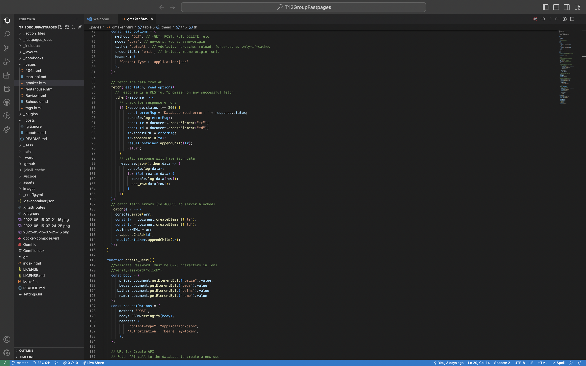
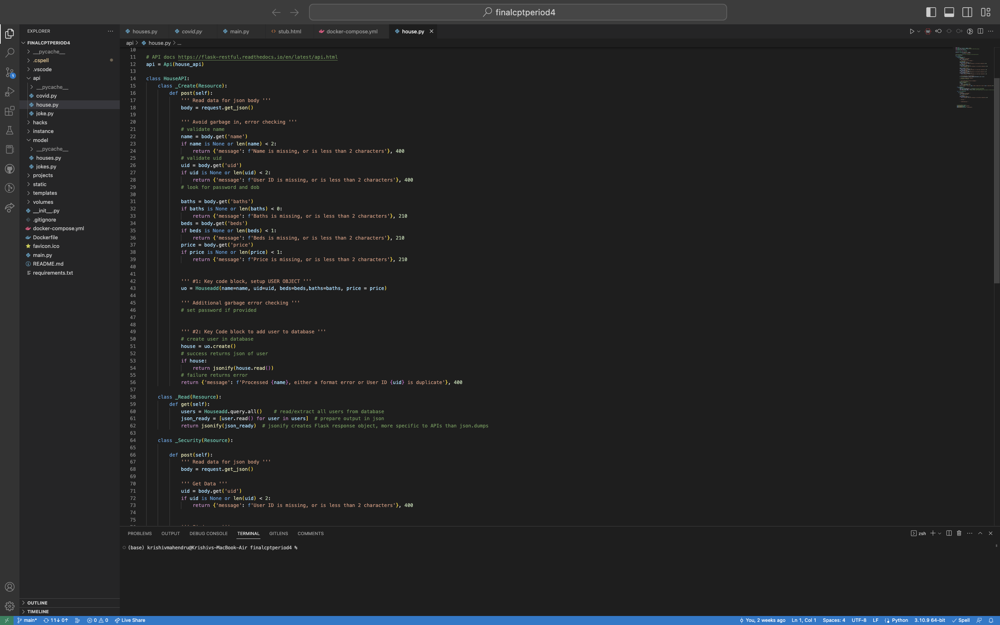

# Video 

[Video Link](https://youtu.be/AbeMyVySezU)

# Row 1 Program and Function Purpose 
-  The purpose of the program is to allow for users to add houses and explore them for vacations in San Diego, California this serves as a tool for users.
- The function of the program is to add houses to the table which are saved through an SQLight database within a python flask. This screen updates every time a new house is added allowing to show saved data.
- The inputs of this is allowing users to enter data within a form which results in a cell in a table with information about their available house. In addition I enter random data not associated with the program to show that the code is not accepted for random characters other than the $ sign.

# Row 2 Data Abstraction

- The data has been stored within a SQLite database, through unique classes and functions. Which allows users to get their data and fetch into working, updating elements of a table through read_users; function
- The data represents the get method from the users input of the api after the post.

# Row 3 Managing Complexity

- The data is used by the create_users functions which allows users data to be stored through the post method which adds to the database;
- The read_users and create_users function allows to manage the complexity as it allows for a set function which responds to that function within the frontend and links it to the backend.

# Row 4

- This functions shows the create_users being a parameter being called From the backend. it allows for a post method which creates a cell and adds that to the database. It gets called as users use the information within the form and if set variable are defined they are given a correct output.
- Contributes to the overall function as it allows for more users to add a house giving more options to chose. 

# Row 5

- This algorithm allows for filtering of the inputs as it is needed to be 2 characters or more of letters allowing the function when being called to work if set commands are fulfilled throughout this program. This is used through the class definiton of post which is defined and is called within the frontend.

# Row 6
- Results of the first call the first call is called by the post method which adds into the database form the create_user(); function, then the get_user(); function takes the data from the sql database allowing for it to post on a running site. 
- The result of the first call creates all users in  a table and the second call adds users within the database to then add rows within the get function. 